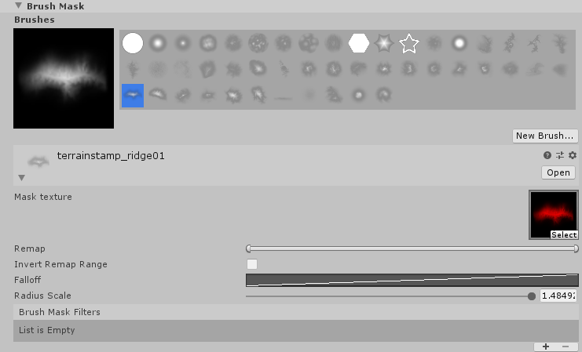
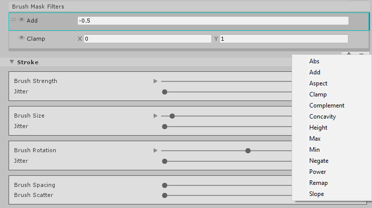
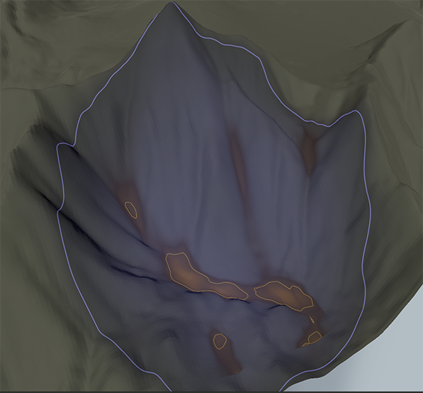

# Brush Mask Filters
A Brush Mask is a Grayscale Texture that Unity uses to control the strength of Terrain editing in specific areas. While black values on a mask do not impact the Terrain, white values have full impact on the Terrain.

By default, all Brush Assets have a Mask Texture, which defines the shape and strength of a Brush. You can change the **Remap** and **Falloff** values to alter this Mask.

To modify the Brush even further, you can add a Brush Mask Filter. For example, if you select the **Add** filter and set a value of 0.1, Unity adds 0.1 to all the pixels of your current Brush Mask. Brush Mask Filters provide a way to procedurally generate Brush Masks.

## Using Brush Mask Filters
There are two types of filters — those that use existing Terrain data to calculate the resulting mask, and those that use math operations to directly modify the mask.

### Terrain-based filters
- Aspect
- Concavity
- Height 
- Slope

### Math operation filters
- Abs
- Add
- Clamp
- Complement
- Max
- Min
- Negate 
- Power
- Remap

Unity sequentially applies Brush Mask Filters starting from the top of the list. Terrain-based filters implicitly blend based on a multiply operation, meaning that the result of one is multiplied by the result of the other.

To add a new Brush Mask Filter, click the **Add (+)** button on the bottom right, and select a filter in the dropdown menu. Each new filter you add appears at the bottom of the list. To remove a Brush Mask Filter, select the target filter in the list, and click the **Remove (-)** button.

Since Unity applies filters starting from the topmost one, you might need to reorder the list of filters. Click and hold the **handle (=)** to the left of a filter, and drag that filter to a new position in the list.

Filters modify the base Brush Mask Texture, and specify which Terrain regions your paint operations affect. Unity highlights these designated areas in orange.

Terrain-based filters give the best results when you use them to paint Terrain Layers (Textures) on the Terrain. This is because the heightmap remains constant as you paint Textures.

Although you can use Terrain-based filters with tools that modify height, you might end up with unusual results and visual artifacts. This is because the system samples, and then edits the heightmap in each frame that the filter runs.