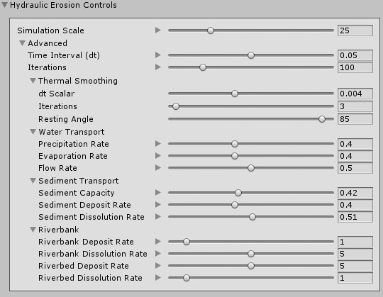

# Hydraulic Erosion

Select a Terrain tile to bring up the Terrain Inspector. In the Terrain Inspector, click the **Paint Terrain** (brush) icon, and select **Erosion > Hydraulic** from the list of Terrain tools.

The Hydraulic Erosion Tool simulates the effect of water flowing across the Terrain surface, and the transport of sediment along the flow field. Use this tool to create valley and fluvial features.

The erosion effect depends on the Terrain size and heightmap resolution. For highly detailed erosion features, use a Terrain heightmap resolution of 1025 or greater.

## Parameters

| **Property**                   | **Function**                                                 |
| ------------------------------ | ------------------------------------------------------------ |
| **Simulation Scale**           | Controls the scale of the simulation, which controls the size of the Terrain features produced by erosion. Increasing this value produces higher frequency details, while decreasing it produces smoother features. |

| **Advanced**     |      |      |
| ---- | ---- | ---- |
| **Time Interval (dt)**         || The time delta for each iteration of the erosion simulation. Higher numbers produce a greater visible effect, but values that are too high lead to simulation instability and inaccuracies. |
| **Iterations**                 || The number of simulation iterations to perform for each Brush stamp. Higher numbers produce more realistic results, but at the cost of performance. |
| **Thermal Smoothing**          ||                                                              |
|| **dt Scalar**                  | A multiplier on the base **Time Interval (dt)** property. This value controls the strength of the thermal smoothing effect. |
|| **Iterations**                 | The number of thermal smoothing iterations to perform. A higher number of iterations results in more thermal smoothing, but impacts performance. |
|| **Resting Angle**              | The angle of repose (talus angle). This is the angle at which sediment naturally settles, and controls Terrain steepness. A lower value results in a flatter Terrain, and the effects are only visible with values lower than the current Terrain angle. |
| **Water Transport**            ||                                                              |
|| **Precipitation Rate**         | The rate at which water falls onto the Terrain. Each step of the simulation adds water to the Terra, which contributes to the water flow calculations. |
|| **Evaporation Rate**           | The rate at which each simulation step removes water from the simulation due to evaporation. |
|| **Flow Rate**                  | The speed at which water flows across the Terrain in the simulation. |
| **Sediment Transport**         ||                                                              |
|| **Sediment Capacity**          | The maximum amount of sediment that the simulation suspends in water for each pixel of the heightmap. |
|| **Sediment Deposit Rate**      | The rate at which the simulation algorithm adds sediment back to the height. |
|| **Sediment Dissolution Rate**  | The rate at which the simulation removes sediment from the height. |
| **Riverbank**                  || The **Riverbank** parameters let you control the shape of the peaks and valleys in the Terrain that erosion simulation creates. &#8226; **Riverbank:** Areas of the heightmap with a surface normal perpendicular to the horizon. &#8226; **Riverbed:** Areas of the heightmap with a surface normal parallel to the horizon. |
|| **Riverbank Deposit Rate**     | The rate at which the simulation deposits suspended sediment onto heightmap surfaces perpendicular to the horizon. |
|| **Riverbank Dissolution Rate** | The rate at which the simulation dissolves sediment from heightmap surfaces perpendicular to the horizon. |
|| **Riverbed Deposit Rate**      | The rate at which the simulation deposits suspended sediment onto heightmap surfaces parallel to the horizon. |
|| **Riverbed Dissolution Rate**  | The rate at which  the simulation dissolved sediment from the heightmap surfaces parallel to the horizon. |