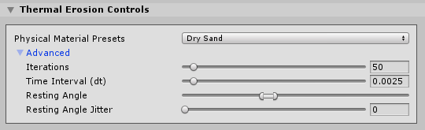

# Thermal Erosion

Select a Terrain tile to bring up the Terrain Inspector. In the Terrain Inspector, click the **Paint Terrain** (brush) icon, and select **Erosion > Thermal** from the list of Terrain tools.

The Thermal Erosion Tool simulates the effect of sediment settling on a Terrain. Different sediment types naturally settle at specific slope angles, known as the *angle of repose* or *talus angle*. This Tool enforces such an angle on the Terrain height field, resulting in natural-looking slopes.

## Parameters

| **Property**                  | **Description**          |                                                              |
| ----------------------------- | ------------------------ | ------------------------------------------------------------ |
| **Physical Material Presets** |                          | Use the drop-down to select the type of sediment material: &#8226; Dry Ash &#8226; Chalk &#8226; Dry Clay &#8226; Wet Clay &#8226; Soil &#8226; Granite Scree &#8226; Wet Sand &#8226; Quick Sand &#8226; Snow Each sediment material preset applies a default set of **Advanced** property values. |
| **Advanced**                  |                          | Use the **Advanced** properties to customize the Thermal Erosion Brush. When you edit these properties, the **Physical Material Presets** property value changes to **Custom**. |
|                               | **Iterations**           | The number of simulation iterations to perform per Brush stamp. Specifying a higher value here produces a more accurate result, but impacts performance. |
|                               | **Time Interval (dt)**   | The time delta for each iteration of the erosion simulation. Higher numbers result in a greater visible effect, but values that are too high lead to simulation instability and inaccuracies. |
|                               | **Resting Angle**        | The angle of repose (talus angle). This is the angle at which sediment naturally settles. Slopes that are steeper than this angle will erode, while slopes less steep will remain untouched. |
|                               | **Resting Angle Jitter** | A random offset per Brush stamp applied to the resting angle. Increasing this value results in more variation. |