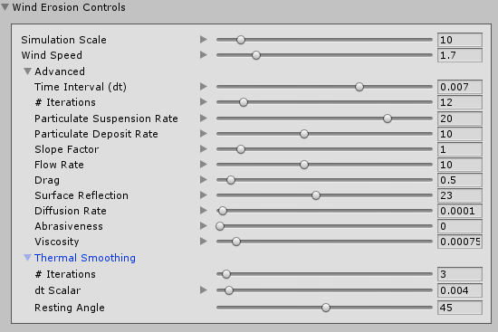

# Wind Erosion

Select a Terrain tile to bring up the Terrain Inspector. In the Terrain Inspector, click the **Paint Terrain** (brush) icon, and select **Erosion > Wind** from the list of Terrain tools.

The Wind Erosion Tool simulates the effect of wind transporting and redistributing sediment. 

The Wind Erosion Tool uses a smooth rotation jitter control, which is slightly different from the standard rotation control. Instead of computing a random rotation value for each frame, this tool uses a smooth noise function to simulate gradual changes in wind direction. Use the **Jitter** slider in the **Brush Rotation** section of the [Common Brush controls](brush-controls-shortcut-keys.md) to control the frequency of these rotation changes.

The erosion effect depends on the Terrain size and heightmap resolution. For highly detailed erosion features, use a Terrain heightmap resolution of 1025 or greater.

## Parameters

| **Property** |      | **Function** |
| ---- | ---- | ---- |
| **Simulation Scale**        | | The scale of the simulation, which controls the size of features that erosion produces. Increasing this value results in smoother features, and decreasing it produces higher frequency details. |
| **Wind Speed**              | | The wind speed at the start of the simulation. Higher wind speeds result in a greater visual effect, but might lead to simulation instabilities. |
| **Advanced**                | |                                                              |
|| **Time Interval (dt)**       | The time delta for each iteration of the erosion simulation. Higher numbers result in a greater visible effect, but values that are too high can cause simulation instability and inaccuracies. |
|| **Iterations**               | The number of simulation iterations to perform for each Brush stamp. Higher numbers produce more realistic results, but at the cost of performance. |
|| **Particle Suspension Rate** | The rate at which the simulation removes sediment particles from the Terrain height. |
|| **Particle Deposit Rate**    | The rate at which the simulation deposits sediment particles onto the Terrain height. |
|| **Slope Factor**             | The degree to which the Terrain slope affects sediment suspension. The simulation removes more sediment from surfaces that are more perpendicular to the wind angle.Examples:0 - No effect based on the slope of the Terrain.1 - Full effect based on the slope of the Terrain. |
|| **Flow Rate**                | The rate at which suspended sediment particles travel through the wind flow field. Set this value higher to make sediment travel further and faster. |
|| **Drag**                     | The drag coefficient for the wind flow field. Increasing this value will dampen the wind velocity, which results in a smoother effect. |
|| **Surface Reflection**       | The degree to which wind velocities bounce off steep surfaces. |
|| **Diffusion Rate**           | The rate at which suspended sediment diffuses throughout the wind flow field. |
|| **Abrasiveness**             | The rate at which suspended sediment particles erode the Terrain height. |
|| **Viscosity**                | The density of the air, which affects wind fluidity. Higher values slow down the speed of the wind across the Terrain, because the air is thicker. |
| **Thermal Smoothing**       | | After the wind erosion step, you can perform a few iterations of thermal erosion to smooth the Terrain by changing the following parameters. |
|| **# Iterations**             | The number of thermal smoothing iterations to perform. Increasing this results in higher quality thermal smoothing at the expense of performance. |
|| **dt Scalar**                | A multiplier on the time interval to use for thermal smoothing. Increasing this value results in a great smoothing effect, but might lead to simulation instabilities. |
|| **Resting Angle**            | The angle of repose (talus angle). Slopes steeper than this angle are smoothed down until they meet this threshold. |