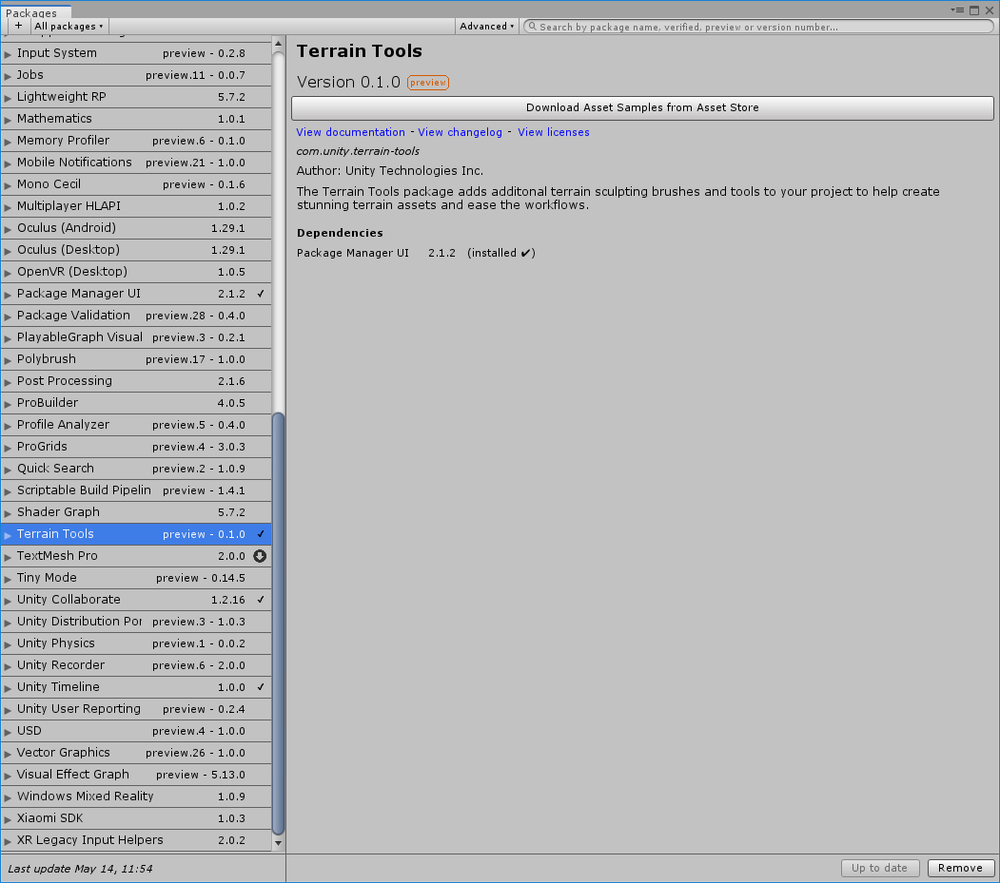
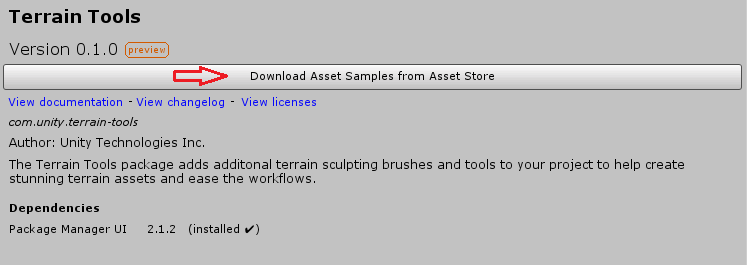

# Getting started with Terrain Tools

Terrain Tools is a package that you can optionally add to any project in Unity 2019.1 or later.

To add the package to your project, you must install it from Package Manager. Click **Window** > **Package Manager**, search for *Terrain Tools*, and click the **Install** button in the lower right corner.

After you've installed the package, a new **Download Asset Samples from Asset Store** button appears on the top. Clicking it directs you to Unity's Asset Store, where you can download the Terrain Tools Asset Sample Pack. The sample pack includes many high-quality Terrain Brushes and Textures to help you begin working on Terrain. 

