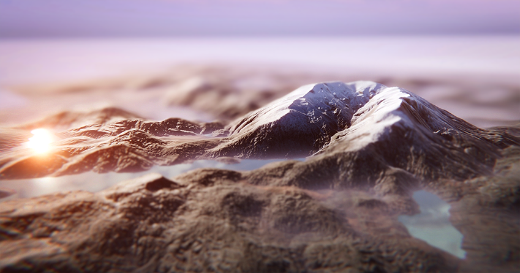

# Terrain Tools

The Terrain Tools package helps improve the workflow for creating Terrain in Unity. 

The Unity 2019.1 package contains brand new sculpting Brushes, and a collection of utilities and tools to help automate tedious tasks. 

In the Unity 2019.2 package, we added new Brush Mask Filters to enhance sculpting, and Material painting tools to help you achieve beautiful results on Terrain.