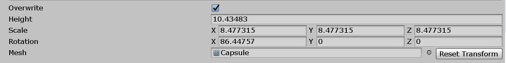

# Mesh Stamp

The **Mesh Stamp** projects the shape of a mesh into the heightmap of your Terrain. To access the **Mesh Stamp** tool, select a Terrain tile to bring up the Terrain Inspector. In the Terrain Inspector, click the **Paint Terrain** (brush) icon, and select **Mesh Stamp** from the list of Terrain tools.

To stamp a mesh on the Terrain, assign a mesh in the parameters, then click to stamp a downward projection of that mesh into the Terrain's heightmap. To subtract the mesh from the Terrain's heightmap, hold Ctrl (Option on macOS) and click. To rotate, scale, or set a height offset in the Scene view, hold down the Shift key to bring up an interactive gizmo.

Shapes with holes or a lot of concave details don't work well as mesh stamps. This is because Unity’s Terrain system is heightmap-based, and only the widest section of a convex mesh projects into the heightmap. Details you create in the heightmap using the stamp are based on the Terrain's resolution, and not the vertex density of the assigned mesh. 

## Parameters

| **Property**        | **Description**                                              |
| ------------------- | ------------------------------------------------------------ |
| **Overwrite**       | Enable this checkbox to stamp the mesh into the heightmap additively. Disable this checkbox to remove and replace any existing height data you stamp onto. |
| **Height**          | Set the height offset to add to the mesh stamp. While in the Scene view,old down the Shift key  and move the green up arrow on the gizmo to edit this value.. |
| **Scale**           | Change the scale of the mesh stamp. While in the Scene view, hold down the Shift key and select any of the cubes on the gizmo to edit these values. |
| **Rotation**        | Change the rotation of the mesh stamp. While in the Scene view, hold down the Shift key and select any of the axes of the wireframe sphere gizmo to edit these values. |
| **Mesh**            | Assign the mesh to stamp on the Terrain.                     |
| **Reset Transform** | Reset the transform values, so that **Scale** is (1,1,1), **Rotation** is (0,0,0), and **Height** is 0. |