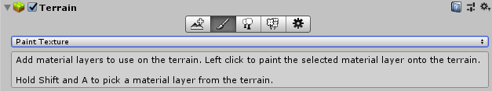
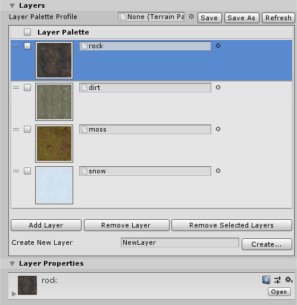

# Paint Texture

Use the **Paint Texture** tool to add Textures such as grass, snow, or sand to your Terrain. It allows you to draw areas of tiled Texture directly onto the Terrain. In the **Terrain Inspector**, click the **Paint Terrain** (paintbrush) icon, and select **Paint Texture** from the list of Terrain tools. 

The Terrain Layer Eyedropper tool lets you select a Terrain Layer directly from the Terrain. To use the Eyedropper tool, hold down **Shift + A**, and click on an area of the Terrain to select its Terrain Layer. See [Common Brush controls and shortcut keys](brush-controls-shortcut-keys) for more information about shortcut keys.

## Layers

**Layer Palette Profile** lets you save and load Material Layer Palettes using a preset Asset file. This allows you to recreate the same Layer Palette from a prior one, and you can share preset files with other team members to expedite Terrain creation. 

The **Layer Palette** reorderable list allows you to change each Layer’s assigned alphamap channel by dragging UI elements. To simultaneously remove multiple Layers, enable the checkbox for each corresponding Layer, and then press the **Remove Selected Layers** button.

Use the **Create New Layer** text field to specify a name for the new Layer to create. After you enter a name, press the **Create** button to save that Layer in the selected Assets folder. 