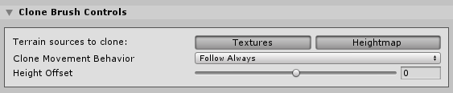

# Clone Tool

The Clone Tool duplicates Terrain from one region to another. To access the Clone Tool, select a Terrain tile to bring up the Terrain Inspector. In the Terrain Inspector, click the **Paint Terrain** (brush) icon, and select **Sculpt > Clone** from the list of Terrain tools.

Hold Ctrl (Option on macOS) and click to set the Terrain area to sample from. Click to apply the cloned area anywhere else on the Terrain. The region to clone from remains the same until you hold Ctrl (Option on macOS) and click to select a new area.

## Parameters

| **Property**                 | **Description**                                              |
| ---------------------------- | ------------------------------------------------------------ |
| **Terrain sources to clone** | Click the **Textures** button to clone the Material splat map. Click the **Heightmap** button to clone the heightmap. If you don't select either button, the tool has no effect. |
| **Clone Movement Behavior**  | &#8226; **Follow Always**: Moves the clone sample area in tandem with the brush. &#8226; **Snap**: Returns the clone sample area to the original location on mouse button release. &#8226; **Follow on Paint**: Updates the clone sample area during painting while holding down the left mouse button. &#8226; **Fixed**: The clone sample area never moves. |
| **Height Offset**            | Adds a height offset so the painted area is lower (negative value) or higher (positive value) than the area cloned from. |