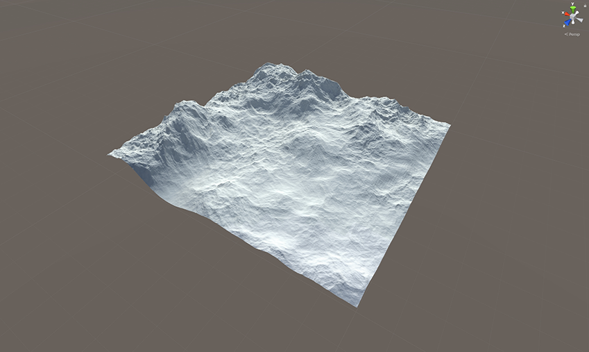
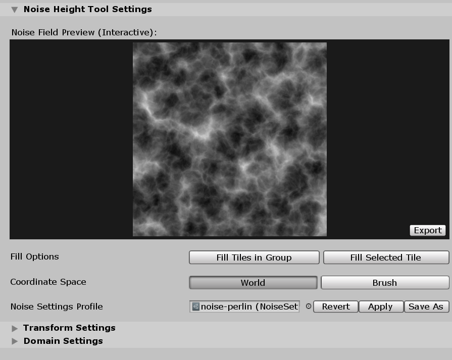

# Noise Height Tool

The Noise Height Tool is a paint-and-fill tool that allows you to use different Noise Types and Fractal Types to modify the height of your Terrain. It uses the shaders that the Noise Library generates, and the Tool Shader Generator for the Noise Height Tool.

Select a Terrain tile to bring up the Terrain Inspector. In the Terrain Inspector, click the **Paint Terrain** (brush) icon, and select **Sculpt > Noise** from the list of Terrain tools.

## Parameters

### Noise Field Preview (Interactive)

The **Noise Field Preview** is an interactive preview that shows the output of the current noise and fractal variant that you set using the Noise Settings and Noise Settings View.

Depending on the noise and fractal variant, you might see different colors in the **Noise Field Preview**. Here are different colors and their meanings.

| **Color**     | **Description**                                              |
| ------------- | ------------------------------------------------------------ |
| **Grayscale** | Output values are within the 0-1 range.                      |
| **Cyan**      | Output values are negative.                                  |
| **Black**     | Output values are 0.                                         |
| **Red**       | Output values are above 1. This helps you debug any normalization issues when exporting noise Textures. It’s best to have exported values that are unsigned and normalized between the 0-1 range. |

#### Controls

- **Translation and Panning:** Click on the preview to pan the noise field, and drag the cursor to modify the translation of the noise field.
- **Scale and Zoom:** To modify the scale of the noise field, place the cursor on the preview, and scroll to zoom in or out.

### Export Options

Click **Export** to open a new **Export Noise** window using the source Noise Settings Asset. It has options for exporting the noise to a Texture.

### Fill Options

**Fill Options** allow you to fill the Terrain with height based on noise. These operations use World Space positions to evaluate the noise field.

| **Property**       | **Description**                                              |
| ------------------ | ------------------------------------------------------------ |
| **Fill**           | Click to fill the selected Terrain tile with noise, based on the values you set in the Noise Height Tool’s Noise Settings. |
| **Fill Connected** | Click to fill the selected Terrain tile and all other tiles with the same Group ID, based on the values you set in the Noise Height Tool’s Noise Settings. |

### Coordinate Space

Determines which coordinate space to use for the Noise Height Tool’s paint mode. If you use one of the **Fill Options**, this setting has no effect.

| **Property** | **Description**                                              |
| ------------ | ------------------------------------------------------------ |
| **World**    | Click to use the world-space position of the Terrain’s heightmap texel to calculate noise values. Noise values are fixed in world space, and are unaffected by the Brush’s size. |
| **Brush**    | Click to use the Brush-space UV of the current paint operation to calculate noise values. Since the tool performs noise calculations in the Brush-space, the positions it uses are derived directly from the Brush’s local transform, where the center of the Brush is the origin, and the noise-field positions scale with the Brush’s size. |

### Noise Settings Profile

The Noise Settings Asset object field allows you to assign a Noise Settings Asset for use with the Noise Height Tool. Be aware that there are two possible states here:

1. When a Noise Settings Asset is unassigned, the Tool uses an internal instance of a Noise Settings Asset, which you can still modify through the UI. Two buttons appear to the right of the object field — **Reset** and **Save As**.

1. When a Noise Settings Asset is assigned, the Tool copies the settings stored in that Asset. When you modify the noise settings through the UI, you aren’t modifying the Noise Settings Asset that is stored on disk, thus preventing any unwanted changes as you tweak the values. Three buttons appear to the right of the object field — **Revert**, **Apply**, and **Save As**.

Below are descriptions for each of the buttons that accompany the Noise Settings Asset object field.

| **Button**  | **Description**                                              |
| ----------- | ------------------------------------------------------------ |
| **Reset**   | Resets the Noise Settings Asset to the default built-in settings. |
| **Revert**  | Reverts the settings of the active Noise Settings Asset to the settings of the original reference that is stored on disk. |
| **Apply**   | Writes the current settings of the Noise Height Tool’s Noise Settings Asset to the original reference stored on disk. |
| **Save As** | Opens a window that allows you to save the settings to a new Noise Settings Asset in your project’s `Assets` folder. Also assigns the newly-created Noise Settings Asset in the object field. |

See the [Noise Settings API documentation](../api/UnityEditor.Experimental.TerrainAPI.html) for more information about the actual settings stored in the Noise Settings Asset.

