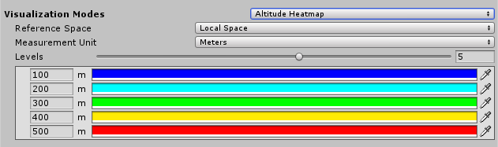

# Altitude Heatmap Visualization

Select **Altitude Heatmap** to visualize the height of your Terrain at different levels of elevation. 

| **Property**         | **Description**                                              |
| -------------------- | ------------------------------------------------------------ |
| **Reference Space**  | Select a splatmap from the list to preview it on multiple Terrain tiles. |
| **Measurement Unit** | Select either **Meters** or **Feet**. A Unity unit is equivalent to 1 meter, which is approximately 3.28 feet. |
| **Levels**           | Use the slider to select how many levels of elevation to visualize. |
| **Levels Altitude**  | Alternatively, enter an altitude level in the number field.  |
| **Levels Color**     | Use the color field or Eyedropper tool to select a color to use when visualizing a specific height level. |