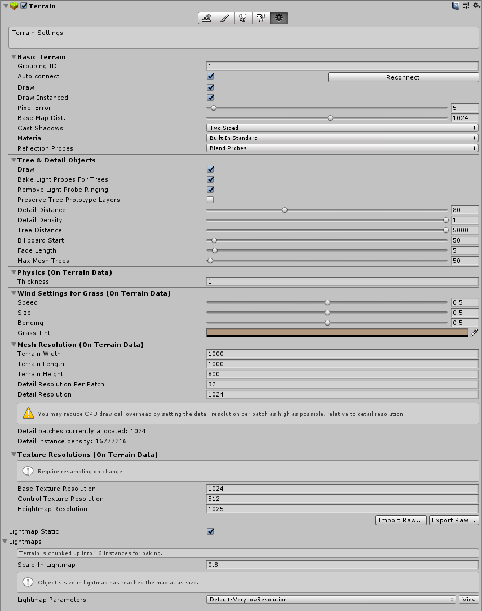
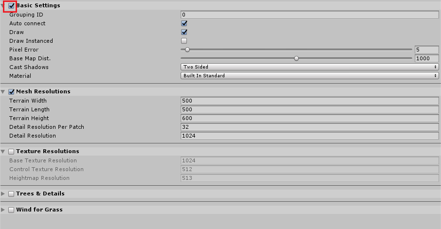

### Change and apply settings

All the Terrain Settings in the wizard are identical to the Terrain Settings in the Inspector. See [Terrain settings](https://docs.unity3d.com/Manual/terrain-OtherSettings.html) for more information about each setting.

However, in the Terrain Toolbox, settings are split into sections that can be enabled or disabled for better batch processing. When you apply changes using the Toolbox, only settings in enabled sections are updated. Use the checkbox on each section's expander menu to enable or disable its group of settings.

### Apply

Click **Apply to Selected Terrain(s)** to apply modified Terrain settings to selected Terrain, or click **Apply to All Terrain(s)** to apply those settings to all Terrain in the Scene.

