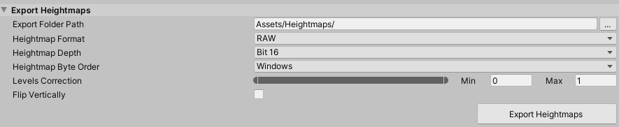

## Export Heightmaps

The **Export Heightmaps** tool lets you export height data from multiple Terrain into textures, and provides some additional settings. 

| **Property**             | **Description**                                              |
| ------------------------ | ------------------------------------------------------------ |
| **Export Folder Path**   | The directory path to export heightmap textures to.          |
| **Heightmap Format**     | Displays the texture format. Unity currently supports PNG, RAW, and TGA file format for heightmaps. |
| **Heightmap Depth**      | Select 16 bit or 8 bit.                                      |
| **Heightmap Byte Order** | Select Windows or Mac.                                       |
| **Levels Correction**    | Remaps the height range prior to export. Similar to Input Levels in Photoshop, this makes bright areas brighter, and dark areas darker. |
| **Flip Vertically**      | Flips Terrain heights vertically, which is useful when you need to import heightmaps into other programs such as World Machine. |
| **Export Heightmaps**    | Click this button to export heightmaps from selected Terrain in the Scene or hierarchy. |