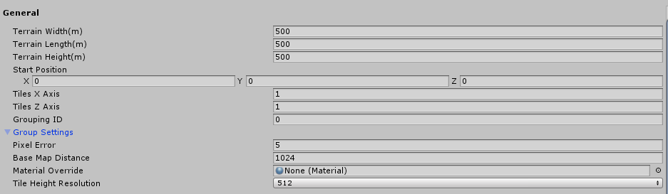
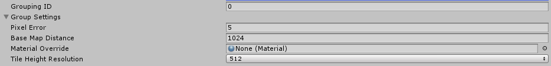

# General settings

The **General** settings include basic information needed to create a new Terrain, such as Terrain width, length, height, and number of tiles. 

| **Property**       | **Description**                                              |
| ------------------ | ------------------------------------------------------------ |
| **Terrain Width**  | The total width of the Terrain (in meters along the X axis). |
| **Terrain Length** | The total length of the Terrain (in meters along the Z axis). |
| **Terrain Height** | The height of the Terrain (in meters along the Y axis).      |
| **Start Position** | The start position of the first tile (X, Y, Z).              |
| **Tiles X Axis**   | The number of tiles along the X axis.                        |
| **Tiles Z Axis**   | The number of tiles along the Z axis.                        |

## Group Settings

**Group Settings** allow you to apply the same settings to new Terrain tiles in a group. Often, a group of Terrain tiles share the same Grouping ID, heightmap resolution, and Material.

| **Property**               | **Description**                                              |
| -------------------------- | ------------------------------------------------------------ |
| **Grouping ID**            | The grouping ID for the new Terrain tiles.                   |
| **Pixel Error**            | The accuracy of the mapping between Terrain maps (such as height maps and textures) and generated Terrain. Higher values indicate lower accuracy, but with lower rendering overhead. |
| **Base Map Distance**      | The maximum distance at which Unity displays Terrain textures at full resolution. Beyond this distance, the system uses a lower resolution composite image for efficiency. |
| **Material Override**      | A custom Material to render the Terrain with. Specify **None** to use the default material. |
| **Tile Height Resolution** | The pixel resolution of the Terrain’s heightmap, also known as Heightmap Resolution. |
