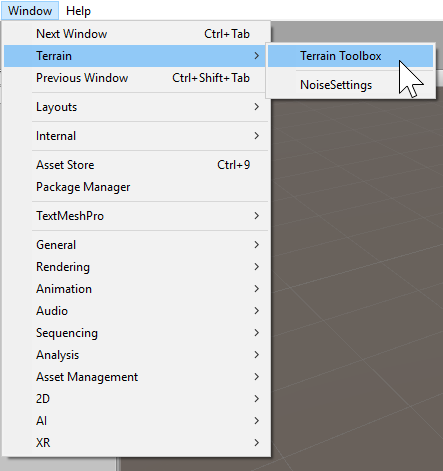
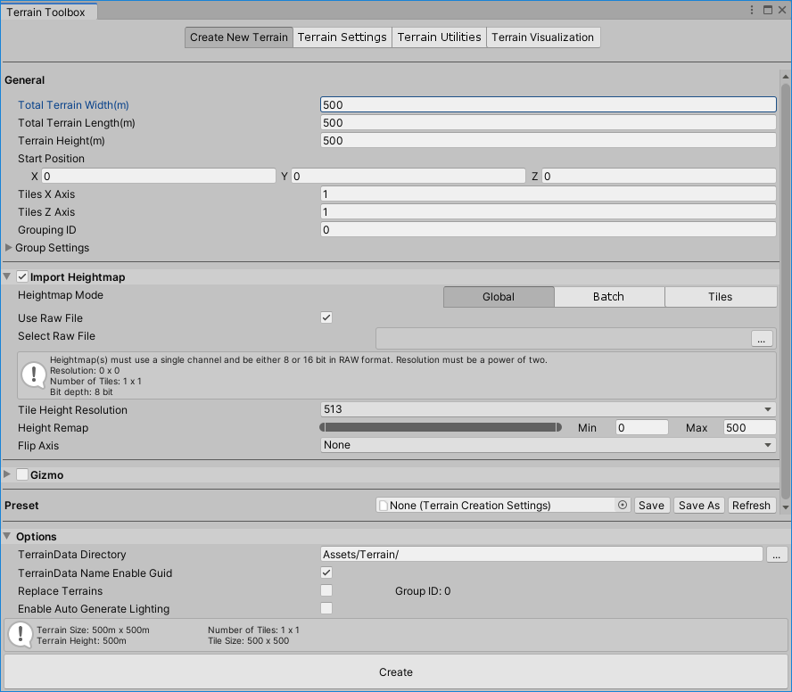

# Getting started with the Terrain Toolbox

The Terrain Toolbox is a tool that can be opened in the Editor, which contains useful tools to help ease Terrain workflows. It allows you to create new Terrain from preset settings or imported heightmaps, batch change Terrain settings on multiple Terrain tiles, and import/export splatmaps and heightmaps using the tools from the Toolbox. 

## Launch the Terrain Toolbox

To launch the Terrain Toolbox, select **Window > Terrain > Terrain Toolbox**. 

The Toolbox window is a dockable window in the Editor, just like the Inspector. It comes with three tool wizards: **Create New Terrain**, **Terrain Settings** and **Terrain Utilities**. 

