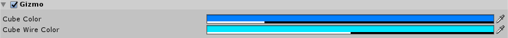
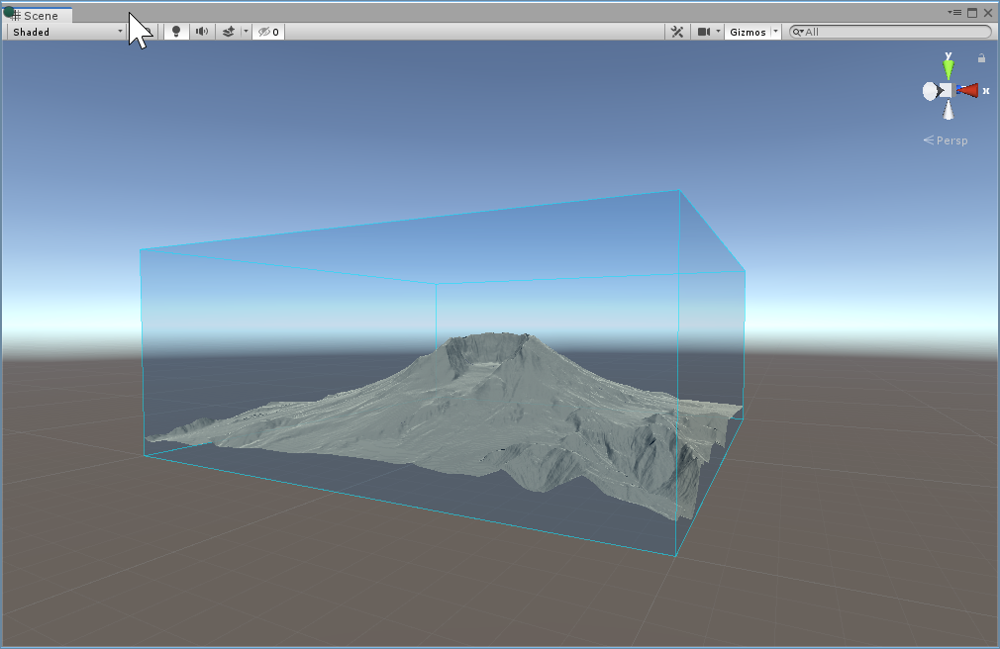

## Gizmo

The **Gizmo** is a transparent cube that appears in Scene view to help identify the location and scale of the Terrain. Enable the checkbox to display the Gizmo, and disable the checkbox to remove it. Click the arrow beside the checkbox to display color selection fields for the Gizmo's cube and wire frame. You can use the **Move**, **Scale**, and **Transform** tools on the Gizmo in Scene view.

_Gizmo in Scene view_

