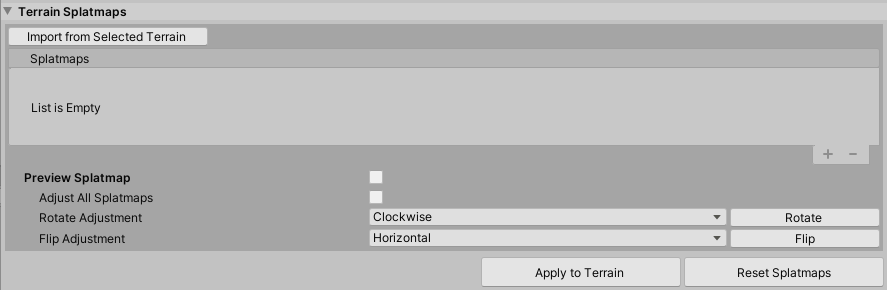
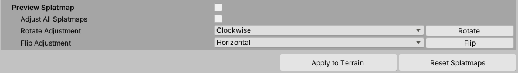

## Import Splatmaps

The **Terrain Splatmaps** tool allows you to import, preview, and adjust splatmaps on multiple Terrain tiles. 

### Splatmap List

The reorderable **Splatmaps** list lets you view the splatmaps you are working with. You can import splatmaps from Terrain selected in Scene view, or add new splatmap Textures.

Use the **Import From Terrain** button to import splatmaps from a selected Terrain. Use the Add (**+**) and Remove (**-**) buttons on the bottom right to add or remove a splatmap. Drag a splatmap row, and move it up or down to change its position in the list.

### Splatmap Preview

**Preview Splatmap** lets you view splatmaps on Terrain tiles.

| **Property**             | **Description**                                              |
| ------------------------ | ------------------------------------------------------------ |
| **Preview Splatmaps**    | Enable this checkbox to preview the splatmaps in the list on selected Terrain tiles. |
| **Adjust All Splatmaps** | Enable this checkbox to adjust all splatmaps in the list.    |
| **Rotate Adjustment**    | Select **Clockwise** or **CounterClockwise** to control the rotation direction. Click the **Rotate** button to rotate splatmaps in the preview. |
| **Flip Adjustment**      | Select **Horizontal** or **Vertical** to control the flip direction. Click the **Flip** button to flip splatmaps in the preview. |
| **Apply to Terrain**     | Click this button to apply splatmap data to the selected Terrain tiles. |
| **Reset Splatmaps**      | Click this button to remove splatmap data from the selected Terrain tiles, and set all splatmaps to their default values. |