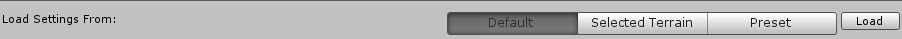

### Load Settings

You can load settings from default values, a selected Terrain in the Scene, or a setting preset file previously saved using the wizard.

To load settings into the wizard, select either **Default**, **Selected Terrain**, or **Preset** in the toolbar, and click the **Load** button.

| **Property**         | **Description**                                      |
| -------------------- | ---------------------------------------------------- |
| **Default**          | Sets all settings to their default values.           |
| **Selected Terrain** | Loads settings from a selected Terrain in the Scene. |
| **Preset**           | Loads settings from a specified preset file.         |

