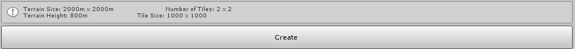

## Options

The Terrain Toolbox includes the following options.

| **Property**                      | **Description**                                              |
| --------------------------------- | ------------------------------------------------------------ |
| **TerrainData Directory**         | The folder path where you save new Terrain data. The default directory is `Assets/Terrain`. |
| **TerrainData Name Enable Guid**  | Enable the checkbox to add a Guid number to the names of the Terrain and Terrain data file. This ensures that names are unique. Disable the checkbox if you prefer simple naming. |
| **Replace Terrains**              | Enable the checkbox when you keep iterating on the same Terrain. This allows new Terrain to replace the prior Terrain and Terrain data with the same Grouping ID. |
| **Enable Auto Generate Lighting** | Enable the checkbox to automatically bake lighting. This option is unchecked by default. |

## Create

When you are ready to create a Terrain, click the **Create** button. There is an information box above the button that displays basic settings of the new Terrain.

The initial part of the creation process runs validations against the Terrain settings, and reports any issues that need to be resolved in order to proceed.