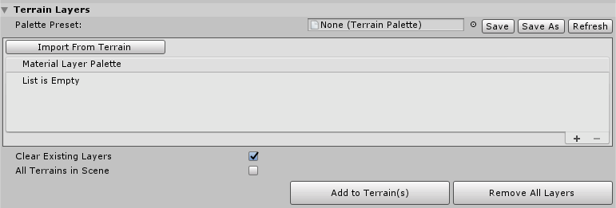
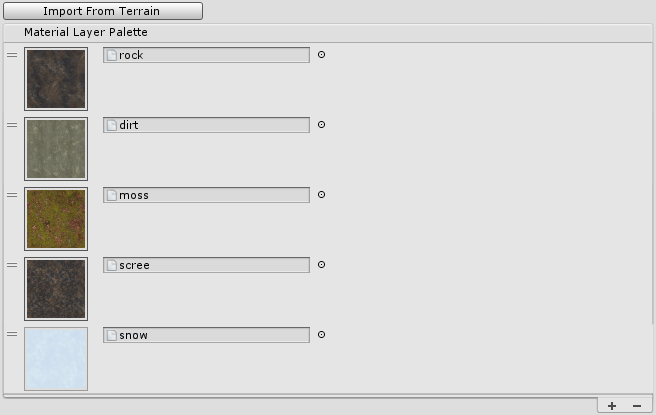
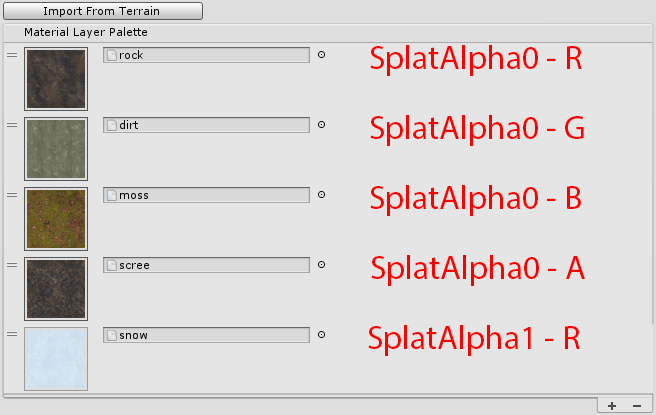
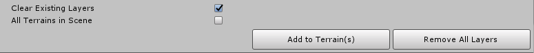

## Terrain Layers

The **Terrain Layers** section contains a few tools to help manage Terrain Layers on Terrain.

### Terrain Palette

A **Terrain Palette** is a preset Asset file that stores a collection of Terrain Layers. This preset file is similar to other Toolbox presets, which you can save or share.

### Material Layer Palette

The **Material Layer Palette** is a reorderable list that contains imported layers. Use the **Import From Terrain** button to import layers from a selected Terrain. Use the Add (**+**) and Remove (**-**) buttons on the bottom right to add or remove a layer. Alternatively, drag a layer row, and move it up or down to change its position in the list.

*Material Layer Palette*

When using the High Definition Render Pipeline, you cannot use more than eight layers. When using the Lightweight Render Pipeline or the built-in Terrain system, there's no limit to the number of layers, but increasing the number of splatmaps uses more memory, which might impact performance.

The list order affects which channel and splatmap a layer uses. For example, the image below shows the respective splatmap and channel each layer uses when you assign them to a Terrain.

### Edit Layers

When you are done configuring the Layer Palette, click **Add to Terrain(s)** to add the layers to Terrain in the Scene.

| **Property**              | **Description**                                              |
| ------------------------- | ------------------------------------------------------------ |
| **Clear Existing Layers** | Enable this checkbox to remove any existing layers on the Terrain before adding new layers from the palette. |
| **All Terrains in Scene** | Enable this checkbox to apply changes to all Terrain in the Scene. Disable this checkbox to apply changes only to selected Terrain in the Scene. |
| **Add to Terrain(s)**     | Add palette layers to Terrain.                               |
| **Remove All Layers**     | Remove all layers from Terrain.                              |