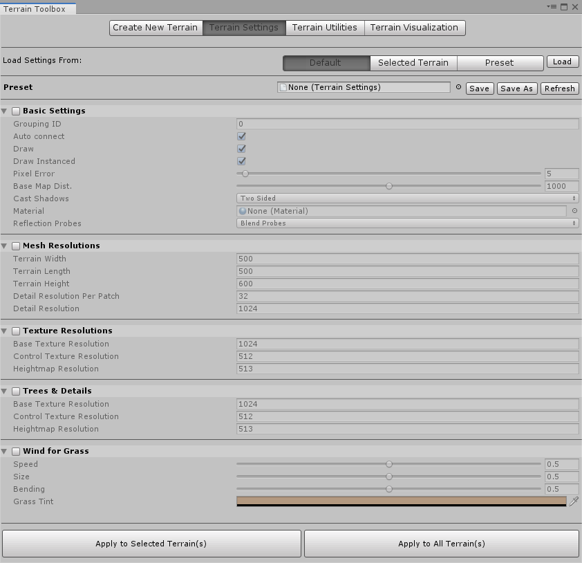

# Terrain Settings

Previously, to change Terrain settings for multiple Terrain tiles in the Editor, you had to select each tile, and make the changes one tile at a time. The **Terrain Settings** wizard in the Toolbox eases this process. It allows you to modify Terrain settings simultaneously for multiple Terrain tiles, and save your settings in a preset Asset files. You can also load settings from existing preset Asset files.

