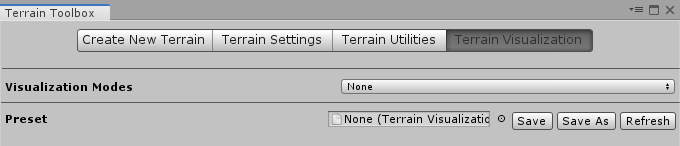

# Terrain Visualization

The **Terrain Visualization** wizard contains tools that make it easier for you to visualize different aspects of a Terrain while you edit it. Use the **Visualization Modes** dropdown menu to select a mode. Currently, the only options are **None** and **Altitude Heatmap**.

