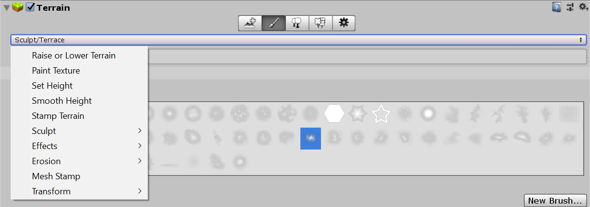
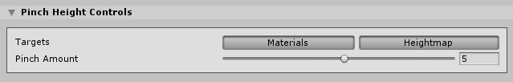

# Pinch Tool

If you set the **Pinch Amount** to a positive value, the tool pulls Terrain features inward towards the center of the Brush. If you set the **Pinch Amount** to a negative value, the tools does the opposite, and bulges Terrain features outwards away from the center of the Brush.

Select a Terrain tile to bring up the Terrain Inspector. In the Terrain Inspector, click the **Paint Terrain** (brush) icon, and select **Transform > Pinch** from the list of Terrain tools.

## Parameters

| **Property**     | **Description**                                              |
| ---------------- | ------------------------------------------------------------ |
| **Targets**      | Defines the Tool targets. Click the **Materials** button to make the Tool affect the Material splat map texture. Click the **Heightmap** button to make the Tool affect the Heightmap texture. |
| **Pinch Amount** | The strength of the pinch or bulge effect. Examples: &#8226; 100 pinches the Terrain into a sharp point. &#8226; 0 does nothing. &#8226; -100 bulges the Terrain outwards to the maximum. |