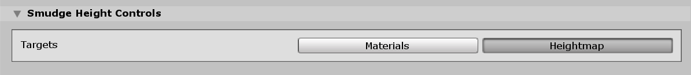

# Smudge Tool

The Smudge Tool moves Terrain features along the path of the Brush stroke.

Select a Terrain tile to bring up the Terrain Inspector. In the Terrain Inspector, click the **Paint Terrain** (brush) icon, and select **Transform > Smudge** from the list of Terrain tools.

## Parameters

| **Property** | **Description**                                              |
| ------------ | ------------------------------------------------------------ |
| **Targets**  | Defines the type of Texture that the Tool smudges. Click the **Materials** button to make the Tool affect the Material splat map Texture. Click the **Heightmap** button to make the Tool affect the Heightmap Texture. If you don't select either button, the tool has no effect. |