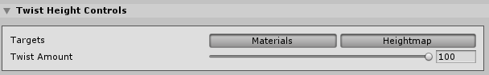

# Twist Tool

Select a Terrain tile to bring up the Terrain Inspector. In the Terrain Inspector, click the **Paint Terrain** (brush) icon, and select **Transform > Twist** from the list of Terrain tools.

The Twist Tool rotates Terrain features around the center of the Brush, along the path of the Brush stroke.

## Parameters

| **Property**     | **Description**                                              |
| ---------------- | ------------------------------------------------------------ |
| **Targets**      | Defines the type of Texture that the Tool twists. Click the **Materials** button to make the Tool affect the Material splat map Texture. Click the **Heightmap** button to make the Tool affect the Heightmap Texture. If you don't select either button, the tool has no effect. |
| **Twist Amount** | The amount of rotation to twist Terrain features. The larger the value, the more intense the twist effect. Set a positive value to rotate features clockwise, and a negative value to rotate them counter-clockwise. |